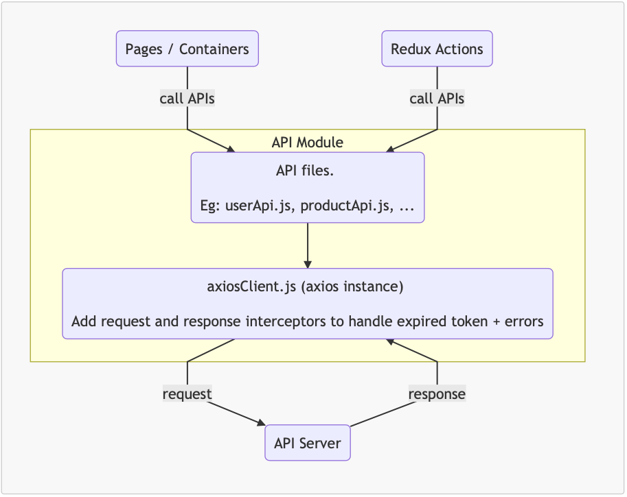

# 🕹️ API Module

- 📲 Cài đặt Axios : `yarn add axios`
- 📲 Tạo file axiosClient kiểm soát dữ liệu API ra vào
- 📲 Tạo các file API tương ứng cho từng feature
- 📲 Gọi API sử dụng `useEffect`
- 📲 Nhận và cập nhật dữ liệu API sử dụng `useState`
- 📲 Xử lý và hiển thị dữ liệu từ API